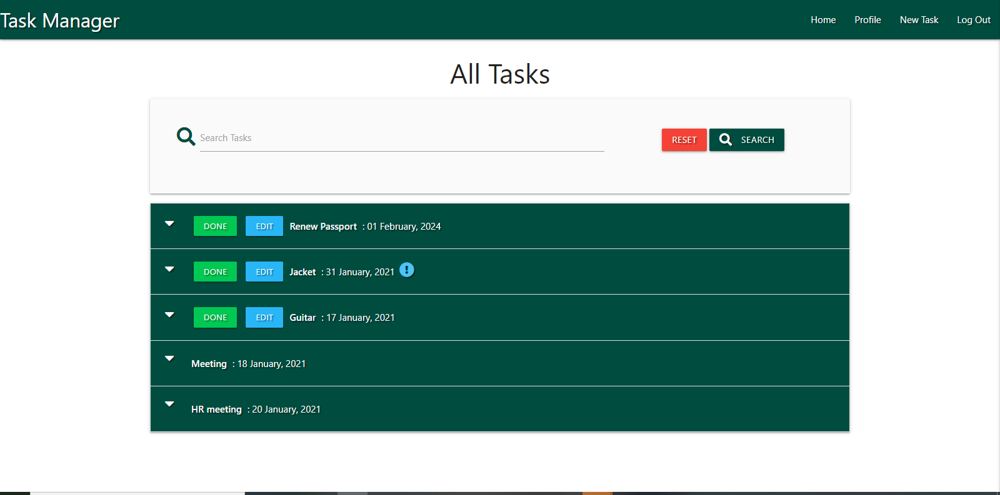
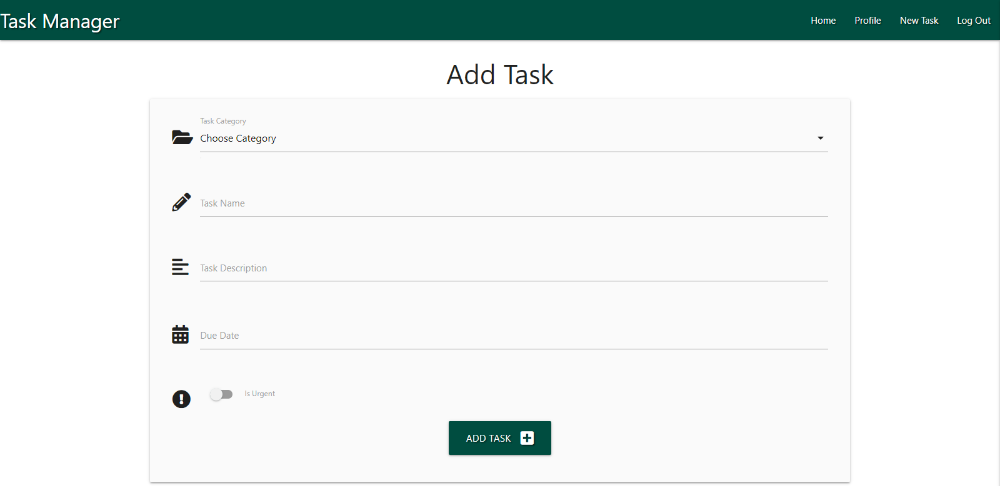
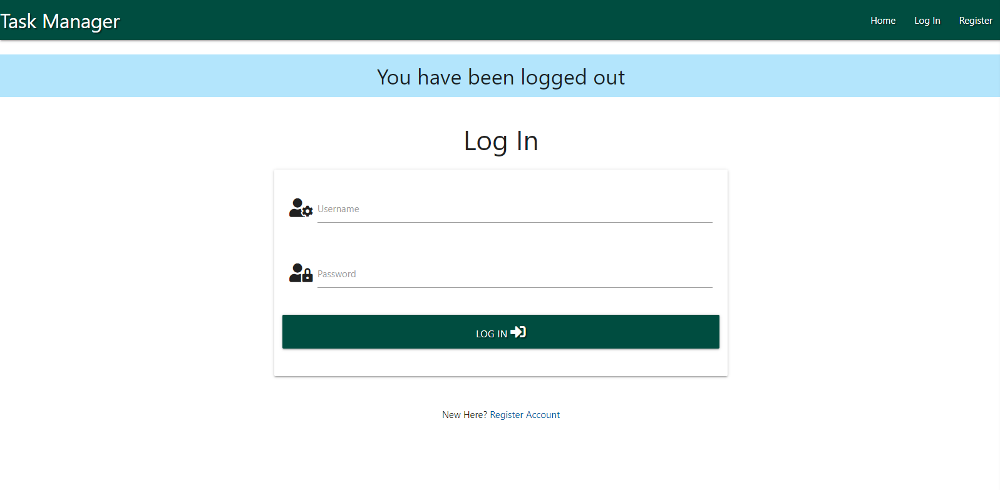
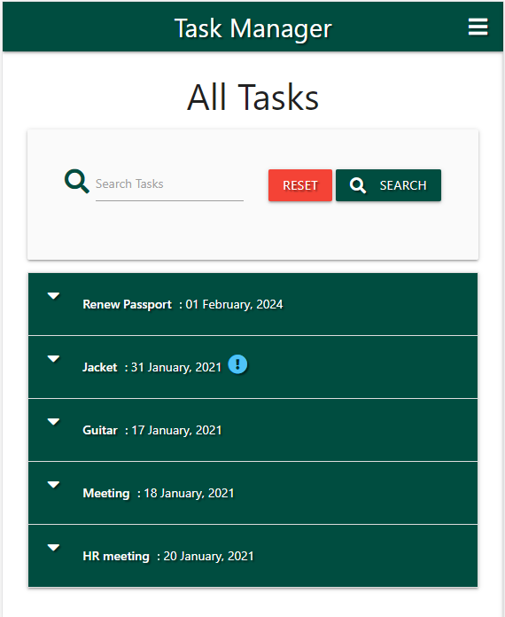
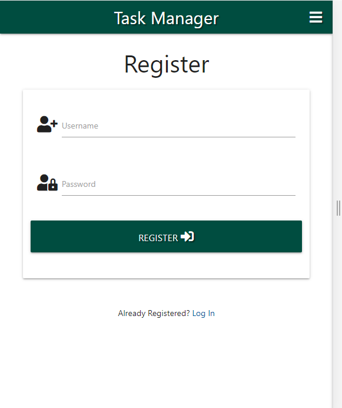

**Task Manager**

**About Task Manager Project**

This project demonestrate my skills on flask using MongoDb

**Languages**

* HTML

* CSS

* Materialize

* Javascript

* python

* flask framework

* MongoDB

__screen blueprint__

[__Click Here__](http://flask-task-manager-project-wia.herokuapp.com/get_tasks)
